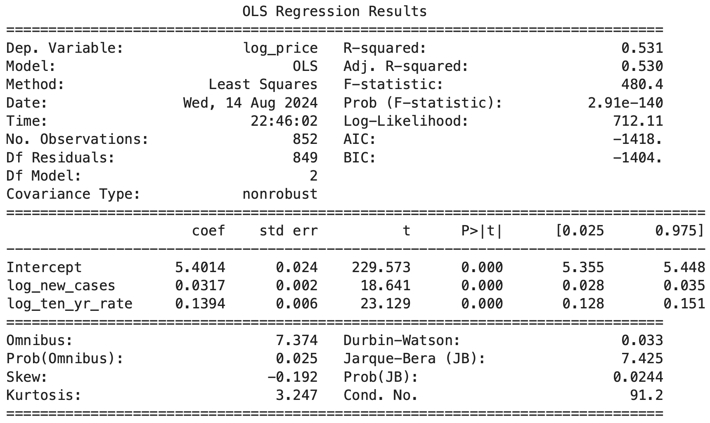
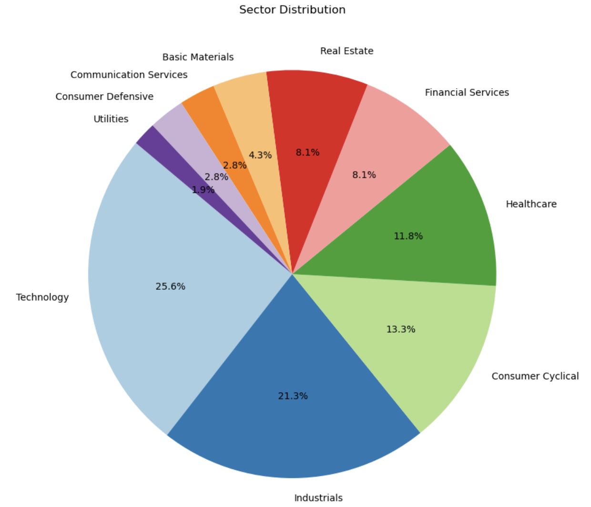
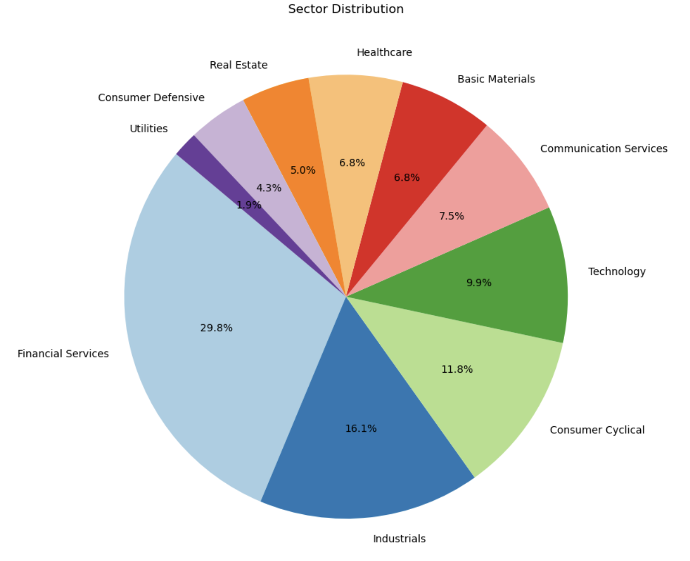
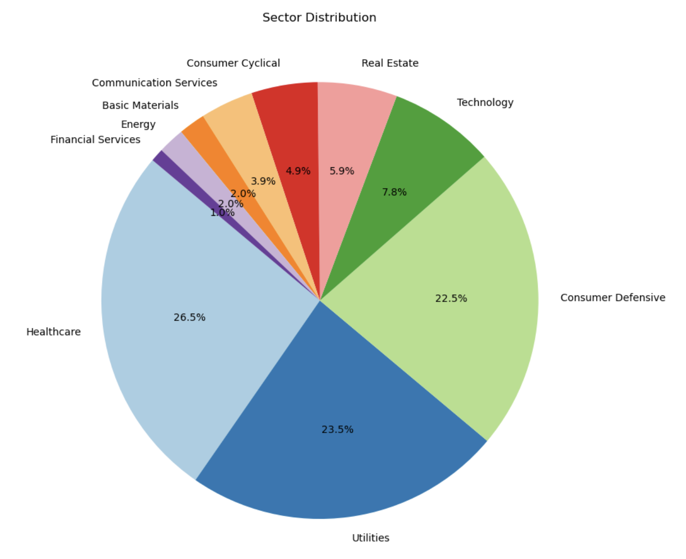
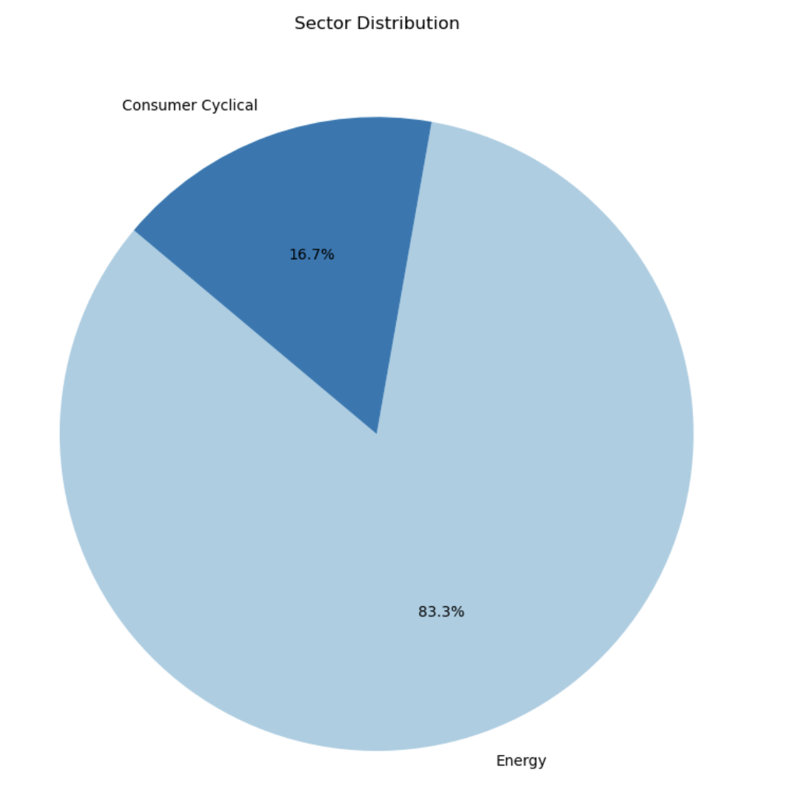
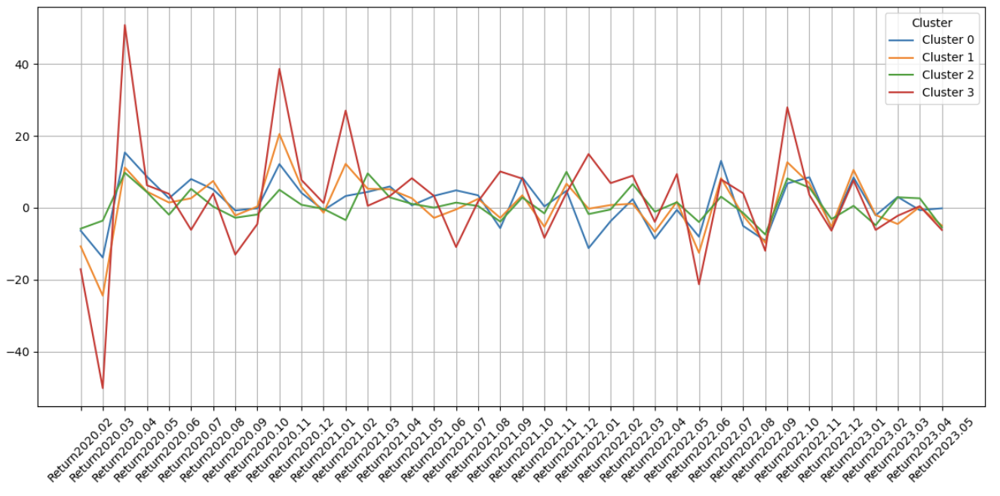

# Pandemic Portfolio Optimization

The purpose of this project is to analyze the impact of the COVID-19 pandemic on stock performance within the S&P 500 index and to develop data-driven strategies for portfolio optimization based on clustering and machine learning techniques. By integrating multiple datasets, including COVID-19 case data, stock price information, and financial metrics, the project aims to understand how pandemic-related factors influenced stock prices and how investors could use these insights to make informed decisions. 
## Data Setting 

**1. Data on COVID-19:** This dataset includes the COVID-19 cases and deaths in 207 countries from December 2019 to October 2023. I want to observe how COVID-19 originating from Asia affects the US stock market and how the stock price was correlated with the COVID-19 numbers.  
**2. S&P 500 historical price:** It will be obtained through Kaggle. The dataset contains day-to-day open and close prices from 2010 to the present. I will calculate daily returns for the S&P 500 companies. Return is the key metric used in the project to build the portfolio.  
**3. List of S&P 500 companies:** This dataset contains the company name, symbol, sector, industry, market cap, and EBITDA. They are useful features because they combined price data to show the performance of companies in various industries during the pandemic, helping me develop the stock-picking strategy.  
**4. Stock information:** This dataset will be obtained through Yahoo Finance. Beta is the main information I need as it implies the diversification of the portfolio and allows me to use the CAPM to evaluate the portfolio.  
**5. Risk-free Rate:** This dataset will be obtained through Kaggle. The risk-free rate is an essential part of the CAPM formula and I use the 10-year treasury yield as the risk-free rate.

## Research Questions

**1. Dataset Exploration:** How do each stock and S&P 500 perform during the pandemic? What factors, including pandemic-related data, affected stock prices, and can machine learning models explain these influences?  

The total S&P 500 return during the pandemic is 36.19%. The best-performing stock is SMCI(847.74%), and the worst-performing stock is CCL(-77.86%). In total, 190 stocks outperform the S&P 500, and 313 stocks underperform S&P 500. For investors, the best month is the April of 2020, whereas the worst month is the March of 2020. After manually testing several different combinations of independent variables, taking the log value of new COVID cases and risk-free rates is the best-performing model. Below is the linear regression formula:  

$5.40 + 0.03 \cdot \log(\text{new cases}) + 0.14 \cdot \log(\text{ten yr rate})$   

The coefficients suggest that the two independent variables are positively related to the stock price. R-squared 0.531 represents approximately 53.1% of the variance in the dependent variable is explained by the independent variables.  

**2. Data clustering:** Cluster the data using different methods (Hierarchical Clustering or K-means clustering) and observe the construction of each cluster. What industry accounts for the largest share in each cluster? How many observations are in each cluster, and how did each cluster perform differently during the pandemic?  

The following graph shows the construction of 4 clusters.  
Cluster 0: 
Cluster 1: 
Cluster 2: 
Cluster 3: 

Two different clustering methods generated similar results. Cluster 0 has 211 stocks, with the Technology and Industrial sectors having the largest share. Consumer Cyclical sector and Healthcare sector combined to account for 25% of the cluster. Cluster 0 demonstrates an average monthly return of 1.4% during the pandemic. Cluster 1 has 161 stocks, with the Financial Services sector accounting for the largest portion of this cluster. Cluster 1 demonstrates an average monthly return of 0.942% during the pandemic. Cluster 2 has 102 stocks in cluster 2. Healthcare sector, Utilities sector, and Consumer Defense sector account for 26.5%, 23.5%, and 22.5% of the cluster, respectively. Cluster 2 demonstrates an average monthly return of 0.773% during the pandemic and it is the most stable cluster. Cluster 3 has 24 stocks, with Energy and Consumer Cyclical being the only two sectors in this cluster. Cluster 3 demonstrates an average monthly return of 2.53% during the pandemic and it is the most volatile cluster.

**3. Portfolio Optimization:** How would investors use clusters to optimize and diversify their $1M portfolio? Propose two portfolios for a risk-averse investor and a risk-seeking investor respectively and observe how each of them fluctuates during the pandemic.  

Each cluster demonstrates a unique pattern of fluctuation. 

From the graph, we can see that cluster 3 is the most volatile. A risk-seeking investor tends to favor stocks in this cluster to maximize its profits. In contrast, a risk-averse investor avoids including this kind of stock in the portfolio. In addition, beta is an indication to understand the stock's correlation with the whole market. The market's beta equals to 1, and the higher the stock is, the higher the volatility is. In this project, I simply choose the highest ten beta stocks for risk-seeking investors and the lowest ten beta stocks for risk-averse investors. However, it is not the most common way to optimize a portfolio in the real world. After calculation, the risk-averse portfolio generates a return of 5.8% and the risk-seeking portfolio generates a return of 209% during the pandemic.

